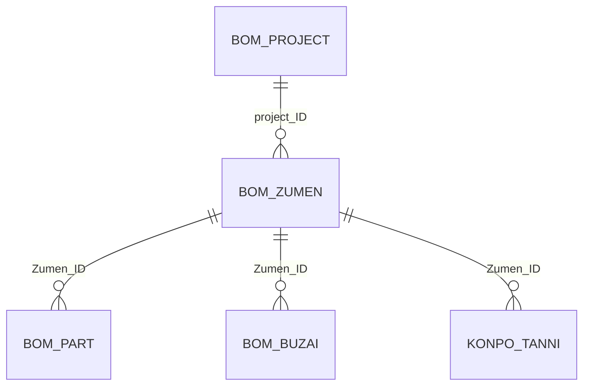

#table
# 図面テーブル（BOM_ZUMEN）

## 1. テーブル概要
図面情報を管理するテーブルです。プロジェクトごとの図面情報、担当者情報、図面の状態などを管理します。

## 2. テーブル定義

### 2.1 基本情報
| 説明           | カラム名           | 型       | 制約          | メモ           |
| ------------ | -------------- | ------- | ----------- | ------------ |
| 行ID          | ROWID          | INTEGER | PRIMARY KEY | 自動採番         |
| [[図面ID]]     | Zumen_ID       | TEXT    | UNIQUE      | 図面の一意識別子     |
| [[プロジェクトID]] | project_ID     | TEXT    | FOREIGN KEY | プロジェクト_図面データ |
| [[図面名]]      | Zumen_Name     | TEXT    |             | 図面データ        |
| [[図面種別]]     | Zumen_Kind     | TEXT    |             | 図面データ        |
| [[組立図面]]     | Kumitate_Zumen | TEXT    |             | 図面データ        |
| [[装置ID]]     | Souti_ID       | TEXT    |             | 図面データ        |
| [[装置名]]      | Souti_name     | TEXT    |             | 図面データ        |
| [[リビジョン番号]]  | rev_number     | TEXT    |             | 図面データ        |
| [[ステータス]]    | status         | TEXT    |             | プロジェクト_図面データ |
| [[出図日]]      | Syutuzubi_Date | TEXT    |             | プロジェクト_図面データ |
| [[作図日]]      | Sakuzu_date    | TEXT    |             | プロジェクト_図面データ |
| [[スケール]]     | Scale          | TEXT    |             | 図面データ        |
| [[サイズ]]      | Size           | TEXT    |             | 図面データ        |
| [[機密コード]]    | Sicret_code    | TEXT    |             | 図面データ        |
| [[書込バージョン]]  | WRITEver       | TEXT    |             | 図面データ        |
| [[関連図面]]     | KANREN_ZUMEN   | TEXT    |             | 図面データ        |


### 2.2 担当者情報
| 説明 | カラム名 | 型 | メモ |
|----------|------|----------|----------|
| [[担当者情報]] 担当者A1 | Tantou_a1 | TEXT | 一次担当者 |
| [[担当者情報]] 担当者A2 | Tantou_a2 | TEXT | 一次担当者補助 |
| [[担当者情報]] 担当者B1 | Tantou_b1 | TEXT | 二次担当者 |
| [[担当者情報]] 担当者B2 | Tantou_b2 | TEXT | 二次担当者補助 |
| [[担当者情報]] 担当者C1 | Tantou_c1 | TEXT | 三次担当者 |
| [[担当者情報]] 担当者C2 | Tantou_c2 | TEXT | 三次担当者補助 |
| [[作図者情報]] 作図者A | Sakuzu_a | TEXT | 主作図者 |
| [[作図者情報]] 作図者B | Sakuzu_b | TEXT | 副作図者 |

## 3. テーブル間の関連

### 3.1 外部キー関連


### 3.2 関連テーブルの詳細

#### BOM_PROJECT（プロジェクトテーブル）
- `project_ID`で関連付け
- 1つのプロジェクトに対して複数の図面が存在可能
- プロジェクトの基本情報を参照

#### BOM_PART（部品テーブル）
- `Zumen_ID`で関連付け
- 1つの図面に対して複数の部品が存在可能
- 図面に含まれる部品情報を管理

#### BOM_BUZAI（部材テーブル）
- `Zumen_ID`で関連付け
- 1つの図面に対して複数の部材が存在可能
- 図面に使用される部材情報を管理

#### KONPO_TANNI（梱包単位テーブル）
- `Zumen_ID`で関連付け
- 1つの図面に対して複数の梱包単位が存在可能
- 図面の梱包情報を管理

## 4. 主要なクエリ

### 4.1 図面と部品の関連取得
```sql
SELECT 
    z.Zumen_ID,
    z.Zumen_Name,
    p.PART_ID,
    p.PART_NAME,
    p.QUANTITY
FROM BOM_ZUMEN z
LEFT JOIN BOM_PART p ON z.Zumen_ID = p.ZUMEN_ID
WHERE z.project_ID = :project_id;
```

### 4.2 図面と部材の関連取得
```sql
SELECT 
    z.Zumen_ID,
    z.Zumen_Name,
    b.BUZAI_ID,
    b.BUZAI_NAME,
    b.BUZAI_WEIGHT,
    b.BUZAI_QUANTITY
FROM BOM_ZUMEN z
LEFT JOIN BOM_BUZAI b ON z.Zumen_ID = b.Zumen_ID
WHERE z.project_ID = :project_id;
```

### 4.3 図面の梱包情報取得
```sql
SELECT 
    z.Zumen_ID,
    z.Zumen_Name,
    k.KONPO_TANNI_ID,
    k.PART_KO,
    k.ZENSU_KO
FROM BOM_ZUMEN z
LEFT JOIN KONPO_TANNI k ON z.Zumen_ID = k.ZUMEN_ID
WHERE z.project_ID = :project_id;
```

## 5. インデックス

### 5.1 自動インデックス
- `ROWID`（主キー）
- `Zumen_ID`（ユニーク制約）
- `project_ID`（外部キー）

### 5.2 推奨インデックス
- `Zumen_Name`（検索頻度が高い）
- `Zumen_Kind`（分類による検索）
- `status`（状態による検索）

## 6. データ整合性

### 6.1 制約
- `Zumen_ID`は一意である必要がある
- `project_ID`は`BOM_PROJECT`テーブルに存在する必要がある
- 必須項目のNULL値は許可しない

### 6.2 トリガー
- 図面削除時の関連データの整合性確保
- ステータス変更時の履歴記録
- リビジョン番号の自動採番

## 7. 運用管理

### 7.1 バックアップ
- 定期的なバックアップの実施
- 変更履歴の保持
- リストア手順の整備

### 7.2 メンテナンス
- 定期的なインデックスの再構築
- 不要データのアーカイブ
- パフォーマンスの監視
