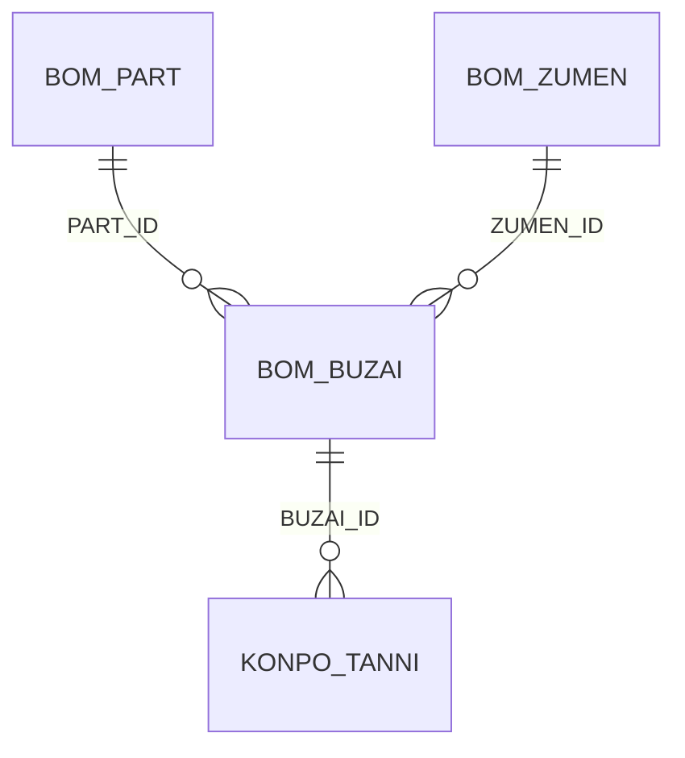

#table
# 部材テーブル（BOM_BUZAI）

## 1. テーブル概要
部材情報を管理するテーブルです。部品に使用される部材の情報、数量、重量などを管理します。

## 2. テーブル定義

### 2.1 基本情報
| 説明 | カラム名 | 型 | 制約 | メモ |
|----------|------|----------|----------|----------|
| 行ID | ROWID | INTEGER | PRIMARY KEY | 自動採番 |
| [[部材ID]] | BUZAI_ID | TEXT | UNIQUE | 部材の一意識別子 |
| [[部品ID]] | PART_ID | TEXT | FOREIGN KEY | 部品データ |
| [[図面ID]] | ZUMEN_ID | TEXT | FOREIGN KEY | 図面データ |
| [[部材名]] | BUZAI_NAME | TEXT | | 部材データ |
| [[数量]] | BUZAI_QUANTITY | INTEGER | | 部材データ |
| [[単位]] | BUZAI_UNIT | TEXT | | 部材データ |
| [[重量]] | BUZAI_WEIGHT | REAL | | 部材データ |
| [[材質]] | MATERIAL | TEXT | | 部材データ |
| [[仕様]] | SPEC | TEXT | | 部材データ |
| [[メーカー]] | MAKER | TEXT | | 部材データ |
| [[型番]] | MODEL_NUMBER | TEXT | | 部材データ |
| [[備考]] | REMARKS | TEXT | | 部材データ |
※XYZでどのくらいの大きさかを入れる項目があれば、梱包リスト作成時に役に立つかも
### 2.2 関連テーブル
| テーブル名 | 関連キー | 関連内容 |
|----------|----------|----------|
| [[部品テーブル]] | PART_ID | 部材が使用される部品 |
| [[図面テーブル]] | ZUMEN_ID | 部材が属する図面 |
| [[梱包単位テーブル]] | BUZAI_ID | 部材の梱包情報 |

## 3. テーブル間の関連

### 3.1 外部キー関連


### 3.2 関連テーブルの詳細

#### BOM_PART（部品テーブル）
- `PART_ID`で関連付け
- 1つの部品に対して複数の部材が存在可能
- 部品の基本情報を参照

#### BOM_ZUMEN（図面テーブル）
- `ZUMEN_ID`で関連付け
- 1つの図面に対して複数の部材が存在可能
- 図面の基本情報を参照

#### KONPO_TANNI（梱包単位テーブル）
- `BUZAI_ID`で関連付け
- 1つの部材に対して複数の梱包単位が存在可能
- 部材の梱包情報を管理

## 4. 主要なクエリ

### 4.1 部品ごとの部材一覧取得
```sql
SELECT 
    b.BUZAI_ID,
    b.BUZAI_NAME,
    b.BUZAI_QUANTITY,
    b.BUZAI_UNIT,
    b.BUZAI_WEIGHT
FROM BOM_BUZAI b
WHERE b.PART_ID = :part_id;
```

### 4.2 図面ごとの部材一覧取得
```sql
SELECT 
    b.BUZAI_ID,
    b.BUZAI_NAME,
    b.BUZAI_QUANTITY,
    b.BUZAI_UNIT,
    b.BUZAI_WEIGHT
FROM BOM_BUZAI b
WHERE b.ZUMEN_ID = :zumen_id;
```

### 4.3 部材の梱包情報取得
```sql
SELECT 
    b.BUZAI_ID,
    b.BUZAI_NAME,
    k.KONPO_TANNI_ID,
    k.PART_KO,
    k.ZENSU_KO
FROM BOM_BUZAI b
LEFT JOIN KONPO_TANNI k ON b.BUZAI_ID = k.BUZAI_ID
WHERE b.BUZAI_ID = :buzai_id;
```

## 5. インデックス

### 5.1 自動インデックス
- `ROWID`（主キー）
- `BUZAI_ID`（ユニーク制約）
- `PART_ID`（外部キー）
- `ZUMEN_ID`（外部キー）

### 5.2 推奨インデックス
- `BUZAI_NAME`（検索頻度が高い）
- `MODEL_NUMBER`（型番による検索）
- `MAKER`（メーカーによる検索）
- `MATERIAL`（材質による検索）

## 6. データ整合性

### 6.1 制約
- `BUZAI_ID`は一意である必要がある
- `PART_ID`は`BOM_PART`テーブルに存在する必要がある
- `ZUMEN_ID`は`BOM_ZUMEN`テーブルに存在する必要がある
- 必須項目のNULL値は許可しない

### 6.2 トリガー
- 部材削除時の関連データの整合性確保
- 数量・重量変更時の履歴記録
- 型番の自動採番

## 7. 運用管理

### 7.1 バックアップ
- 定期的なバックアップの実施
- 変更履歴の保持
- リストア手順の整備

### 7.2 メンテナンス
- 定期的なインデックスの再構築
- 不要データのアーカイブ
- パフォーマンスの監視 