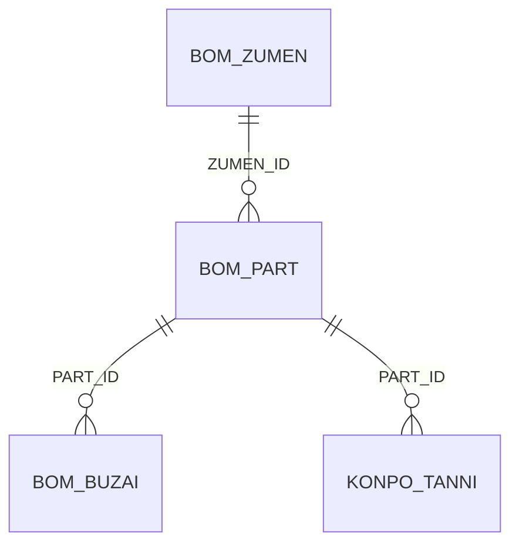

#table
# 部品テーブル（BOM_PART）

## 1. テーブル概要
部品情報を管理するテーブルです。図面に含まれる部品の情報、数量、仕様などを管理します。

## 2. テーブル定義

### 2.1 基本情報
| 説明 | カラム名 | 型 | 制約 | メモ |
|----------|------|----------|----------|----------|
| 行ID | ROWID | INTEGER | PRIMARY KEY | 自動採番 |
| [[部品ID]] | PART_ID | TEXT | UNIQUE | 部品の一意識別子 |
| [[図面ID]] | ZUMEN_ID | TEXT | FOREIGN KEY | 図面データ |
| [[部品名]] | PART_NAME | TEXT | | 部品データ |
| [[数量]] | QUANTITY | INTEGER | | 部品データ |
| [[単位]] | UNIT | TEXT | | 部品データ |
| [[仕様]] | SPEC | TEXT | | 部品データ |
| [[メーカー]] | MAKER | TEXT | | 部品データ |
| [[型番]] | MODEL_NUMBER | TEXT | | 部品データ |
| [[備考]] | REMARKS | TEXT | | 部品データ |
※ボルト、ねじ、パッキンかどうかを選択できるようなカラムはほしい。
### 2.2 関連テーブル
| テーブル名 | 関連キー | 関連内容 |
|----------|----------|----------|
| [[01 図面テーブル（BOM_ZUMEN）]] | ZUMEN_ID | 部品が属する図面 |
| [[02 部材テーブル（BOM_BUZAI）]] | PART_ID | 部品に使用される部材 |
| [[梱包単位テーブル]] | PART_ID | 部品の梱包情報 |

## 3. テーブル間の関連

### 3.1 外部キー関連

	※　部品リスト　→　仮組リスト（　－－－＞製造管理表の作成につながる。）
	※　製造組み立てリスト　→　梱包リスト
	※　梱包単位が梱包リスト、工事リストにつながる
	※　梱包リストから、工事組み立てリストにつながる。

### 3.2 関連テーブルの詳細

#### BOM_ZUMEN（図面テーブル）
- `ZUMEN_ID`で関連付け
- 1つの図面に対して複数の部品が存在可能
- 図面の基本情報を参照

#### BOM_BUZAI（部材テーブル）
- `PART_ID`で関連付け
- 1つの部品に対して複数の部材が存在可能
- 部品に使用される部材情報を管理

#### KONPO_TANNI（梱包単位テーブル）
- `PART_ID`で関連付け
- 1つの部品に対して複数の梱包単位が存在可能
- 部品の梱包情報を管理

## 4. 主要なクエリ

### 4.1 図面ごとの部品一覧取得
```sql
SELECT 
    p.PART_ID,
    p.PART_NAME,
    p.QUANTITY,
    p.UNIT,
    p.SPEC
FROM BOM_PART p
WHERE p.ZUMEN_ID = :zumen_id;
```

### 4.2 部品の部材情報取得
```sql
SELECT 
    p.PART_ID,
    p.PART_NAME,
    b.BUZAI_ID,
    b.BUZAI_NAME,
    b.BUZAI_QUANTITY
FROM BOM_PART p
LEFT JOIN BOM_BUZAI b ON p.PART_ID = b.PART_ID
WHERE p.PART_ID = :part_id;
```

### 4.3 部品の梱包情報取得
```sql
SELECT 
    p.PART_ID,
    p.PART_NAME,
    k.KONPO_TANNI_ID,
    k.PART_KO,
    k.ZENSU_KO
FROM BOM_PART p
LEFT JOIN KONPO_TANNI k ON p.PART_ID = k.PART_ID
WHERE p.PART_ID = :part_id;
```

## 5. インデックス

### 5.1 自動インデックス
- `ROWID`（主キー）
- `PART_ID`（ユニーク制約）
- `ZUMEN_ID`（外部キー）

### 5.2 推奨インデックス
- `PART_NAME`（検索頻度が高い）
- `MODEL_NUMBER`（型番による検索）
- `MAKER`（メーカーによる検索）

## 6. データ整合性

### 6.1 制約
- `PART_ID`は一意である必要がある
- `ZUMEN_ID`は`BOM_ZUMEN`テーブルに存在する必要がある
- 必須項目のNULL値は許可しない

### 6.2 トリガー
- 部品削除時の関連データの整合性確保
- 数量変更時の履歴記録
- 型番の自動採番

## 7. 運用管理

### 7.1 バックアップ
- 定期的なバックアップの実施
- 変更履歴の保持
- リストア手順の整備

### 7.2 メンテナンス
- 定期的なインデックスの再構築
- 不要データのアーカイブ
- パフォーマンスの監視 